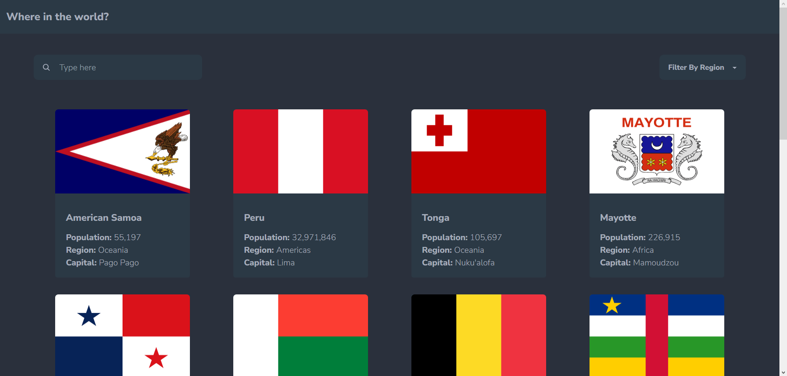
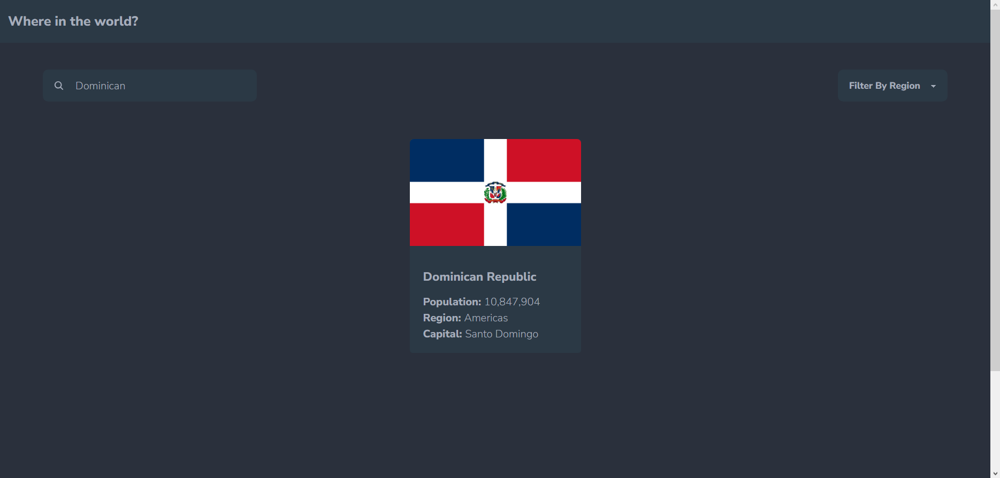
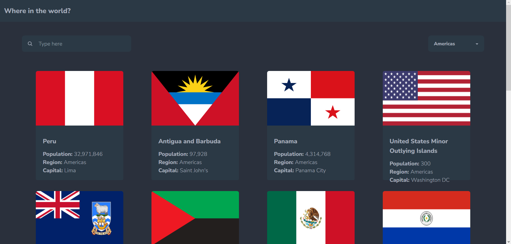
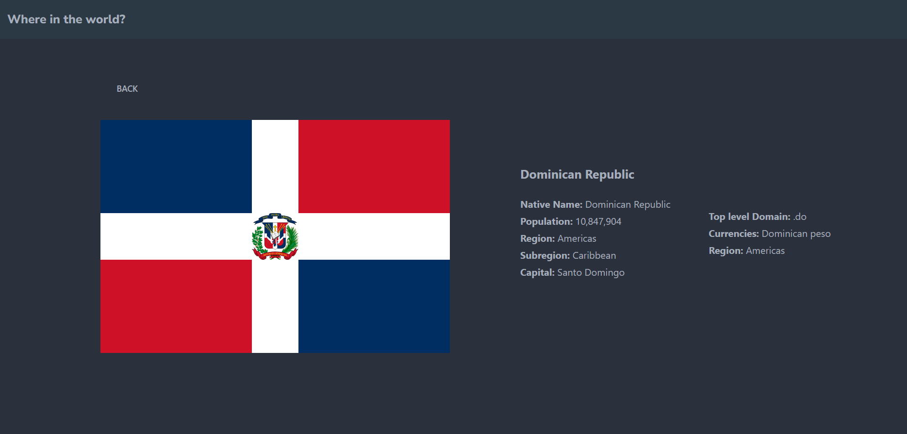

# REST Countries API Aplication

## Pagina principal.

Aqui podemos ver la pagina principal de la aplicacion donde aparecen todos los paises en registrados en la api, esta aplicacion cuenta con varios filtros que estare mostrando mas adelante, esta aplicacion ha sido desarrollada en react.

# Filtros:

## Filtrado por Nombre.

## Filtrado por Region.

## Informacion detallada del pais.

Cuando hacemos click en una de las card que contiene la pagina principal se nos redireccionara a una pagina con informacion mas detallada del pais que se ha seleccionado como podemos ver en la imagen anterior.
